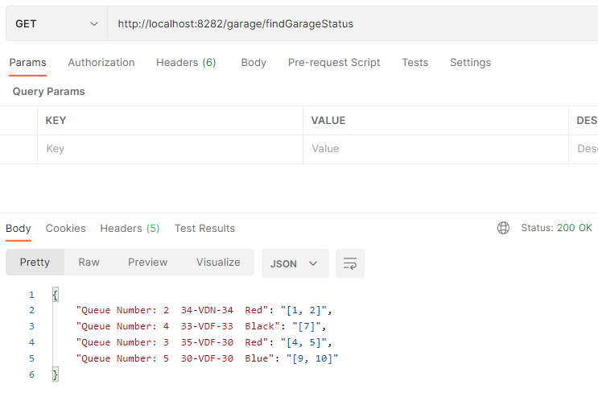
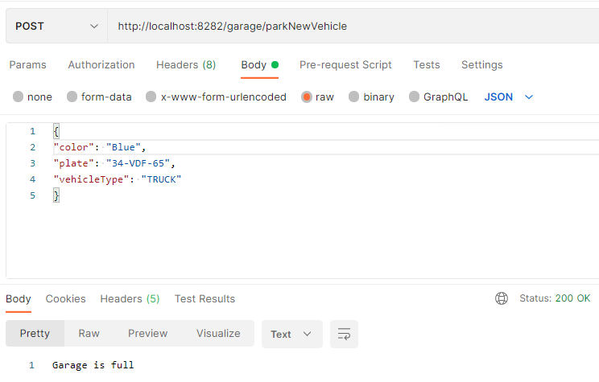
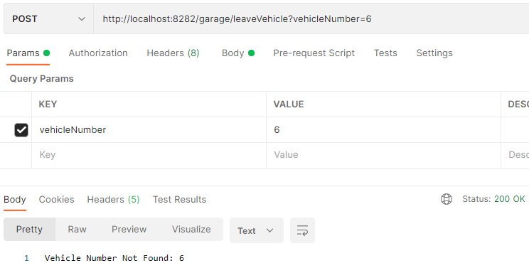

# Garage
 Garage Management Project : This project provides garage management with automated ticketing system.

 Tech: JAVA 8 , Spring Framework

## **How to Running:**
1.Clone or download project

2.mvn clean install

3.Run project.

## **API Detail:**

**Base URL**: http://localhost:8282

**Garage Vehicle Types**: CAR , JEEP, TRUCK (one of these types should be used as the **vehicleType** when parking a new car)

#
**ID:** 1

**Request Method:** GET

**Endpoint URL:** /garage/findGarageStatus

**API Description:** This api find the Garage Status

**Params:** -
#
**ID:** 2

**Request Method:** POST

**Endpoint URL:** /garage/parkNewVehicle

**API Description:** This api parks the vehicle

**Request Body:** 
```
{
"color": "Red",
"plate": "34-VDN-34",
"vehicleType": "CAR"
}
```
#
**ID:** 3

**Request Method:** POST

**Endpoint URL:** /garage/leaveVehicle

**API Description:** This api takes the car out of the parking lot

**Params:** **vehicleNumber**

##
**Sample Request:**  **parkNewVehicle**

**url:** http://localhost:8282/garage/parkNewVehicle

**request:**
```
{
"color": "Red",
"plate": "34-VDN-34",
"vehicleType": "JEEP"
}
```

**Sample Response:**

```
Allocated 2 slots
```
##
**Sample Request:**  **Find Garage Status**

**url:** http://localhost:8282/garage/findGarageStatus

**Sample Response:**

```
{
    "Queue Number: 1  34-VDN-34  Red": "[1, 2]"
}
```
##
**Sample Request:**  **Leave Vehicle**

**url:** http://localhost:8282/garage/leaveVehicle?vehicleNumber=1
**params:** vehicleNumber = 1

**Sample Response:**

```
    200 OK
```


**EXAMPLES**

**alreadyParked**


**garageStatus**



**garageIsFull**



**vehicleNotFound**

